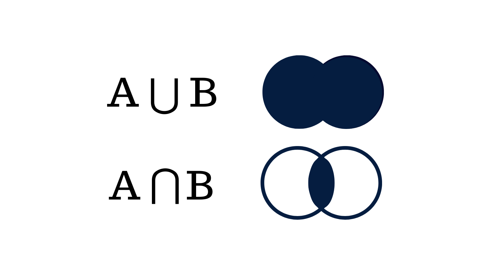

### Jaccard Similarity

##### Introduction

The Jaccard similarity shows us the overlap of data between 2 datasets ranging from 0 to 1.
0 signifying X overlap and 1 showing complete overlap.

The data in these datasets are observations, this could be image data where we're trying to find out how similar 2 images are or it could be text data where we're trying to find out how similar 2 documents are etc.

When these 2 datasets overlap a lot, the Jaccard similarity will be high signifying that the data points/obervations are similar between them.

It is defined by the following formula.

$$

J( A,B) \ =\ \frac{|A\cap B|}{|A\cup B|}

$$

> ∩ : intersection of sets, U : union of sets




Which translates to...

$$

J( A,B) \ =\ \frac{Items\ common\ in\ A\ and\ B}{All\ items\ in\ A\ and\ B}

$$

Let's take an example to demonstrate Jaccard similarity.

We have 2 sets of outputs from 2 different models.
> 0 is a no and 1 is a yes.

A = [0,1,0,1,0,1,0,0,1]

B = [0,0,1,0,1,0,1,1,1]


3 values in A and B are common, while there are 18 values in total in A and B, the Jaccard similarity from the above formula hence turns out to be 0.125. 

This is a useful and easy to interpret metric however is extremely sensitive to small samples sizes and may give inaccurate results, especially with very small samples or even in data sets with missing observations.

Here are some ways to resolve cases of misssing data:
- Fill missing values with the median of the column
- Use K-Nearest Neighbors to fill in missing values
- Fill blanks with zeros or ones

Jaccard similarity can also be used for data with discrete values like integers or even text data, not just 0s and 1s.

##### Example

Let's say we have 2 text documents with these contents:

```py
doc1 = "This is a document about machine learning"
doc2 = "This is a document about data science"
```

We want to see how similar are the documents using Jaccard similarity, so we can first create a dictionary of words in each document.

```py
doc1 = ['This','is','a','document','about','machine','learning']
doc2 = ['This','is','a','document','about','data','science']
```

We can 5 words intersection and 7 words union.
```py
from sklearn.metrics import jaccard_score
js = jaccard_score(doc1,doc2, average="weighted")
print(js)
# 0.7142857142857143
```

Using the formula we get a jaccard similarity of ~ 0.71, which means that the 2 documents have 71% of the words in common.
