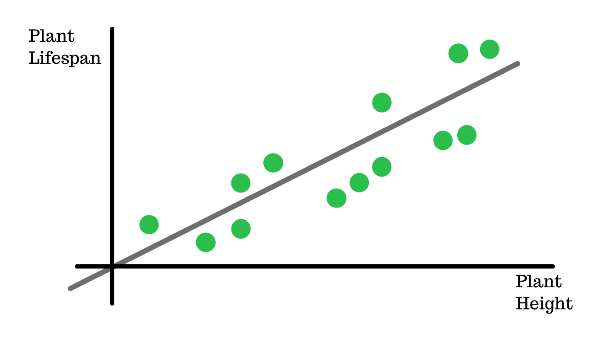

### Mean Squared Error

##### Introduction

The mean squared error (MSE) is a common loss function used for regression problems. The MSE is calculated as the sum of the squared difference between the predicted and actual values of the target variable, divided by the number of training samples, formally defined by this formula:

$$
MSE = \frac{1}{n}\sum_{i=1}^{n}(y_i - \hat{y}_i)^2
$$

Let's understand how this metrics works with an example.

##### Example

A linear regression model is trained on some data of plants to predict their lifespan. This picture shows one of the data points, the height and its corelation to the lifespan along the predicted lifespan according to our linear regression model.

You can notice how the predicted lifespan does not exactly coincide with the values of the ground truth. The difference between the predicted value and the actual value is the 'error'. 

$$
Error = (y_i - \hat{y}_i)
$$

$$
y_i = Actual \ Value 
$$

$$
\hat{y}_i = Predicted \ Value
$$

##### Residual Error
These errors can be positive for negative, for example:

If the predicted lifespan is 10 years and the actual lifespan is 5 years, the error is -5 years and if the predicted lifespan is 5 years and the actual lifespan is 10 years, the error is +5 years.

Adding these up we get an error of -5 + 5 = 0, which does not make sense, there is an error but its not being reflected.

Which is why we square these errors and then sum them up so that the error is actually being reflected, this is called the residual error and forms a part of the MSE formula.

$$
Residual \ Error = (y_i - \hat{y}_i)^2
$$

We sum up all the residual errors, hence the Summation in the formula.

$$
\sum_{i=1}^{n}(y_i - \hat{y}_i)^2
$$

##### Mean

Then we divde this by all the number of data points to get the 'mean', which gives the MSE.

$$
MSE = \frac{1}{n}\sum_{i=1}^{n}(y_i - \hat{y}_i)^2
$$

Now we can understand how the name 'Mean Squared Error' is derived from the formula.

##### Interpretation

The lower the MSE, the better the model is.

Theoretically lets say the MSE is 0  then the model is perfect, all the predictions will exactly match with the ground truth. In this example we'll be able to predict the lifespan of a plant with a linear regression model 100% correctly.

On the other hand if the MSE is very high, then the model is not very accurate, it will predict the lifespan of a plant with a high degree of error. 

##### Problems

As with any metric, there are some caveats when using the MSE.

1. We have to be careful when using this metric, as sometimes when the MSE is low, the model may be overfitting, which means that the model is not able to generalize well to new data.

2. Since we are squaring the errors, we can also get a high MSE if the residual errors are high which can be a problem. In order to avoid this, we can use the Root Mean Squared Error (RMSE), which is the square root of the MSE.

$$
RMSE = \sqrt{\frac{1}{n}\sum_{i=1}^{n}(y_i - \hat{y}_i)^2}
$$